# Preguntas de Final

## Indique cuales son las microinstrucciones necesarias para ejecutar la instrucción SUMAR 3,( 4) en la máquina Super Abacus, siendo 3 y 4 registros de uso general. Se pide además graficar en el esquema de la máquina el flujo de apertura de compuertas usadas en la fase de búsqueda y de ejecución de dicha instrucción.

Las microinstrucciones necesarias para ejecutar la instrucción:

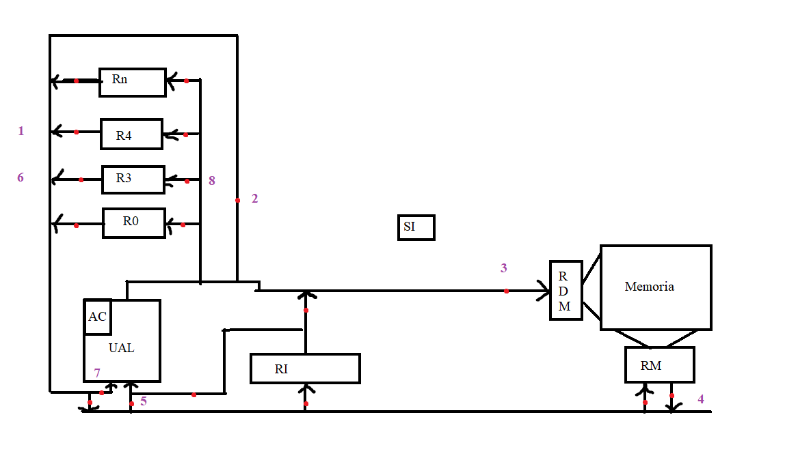

```
SUMAR 3,(4):
(R4) -> RDM
((RDM)) -> RM
(RM) -> AC
(AC) + (R3) -> AC
(AC) -> R3
```

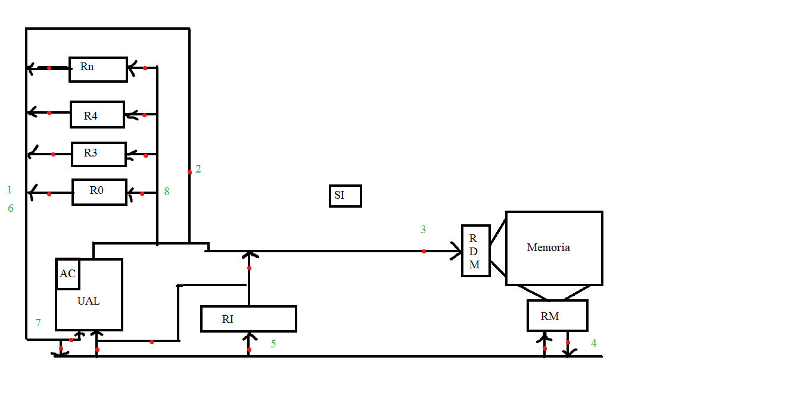

```
Fase de Busqueda
(R0) -> RDM
((RDM)) -> RM
(RM) -> RI
(R0) -> AC
(AC) + 1 -> AC
(AC) -> R0
```

## Explique claramente que es y cómo funciona el barrel shifter en la arquitectura ARM de 32 bits. De ejemplos concretos con instrucciones assembler.

Barrel Shifter son operaciones de bits que nos provee la arquitectura ARM. Estos nos permiten desplazar los bits de los registros de manera muy eficiente. Algo a destacar es que estas operaciones pueden ser utilizadas como segundo operando de cualquier instrucción. Dependiendo el tipo de Barrel Shifter, estos funcionan de diversas formas, por ejemplo:

* Logical Shift Left (LSL): `MOV R0, R1, LSL #4`, guarda en `R0` el resultado de desplazar `4` bits a la izquierda el contenido de `R1`. Es una forma rápida de multiplicar por potencias de 2.
* Logical Shift Right (LSR): `MOV R0, R1, LSR #4`, guarda en `R0` el resultado de desplazar `4` bits a la derecha el contenido de `R1`. Es una forma rápida de dividir por potencias de 2.
* Aritmetic Shift Right (ASR): `ADD R0, R1, ASR #4`. Funciona igual que LSR, pero manteniendo el signo.

## Explique claramente que significan los términos big y little endian, en qué contexto se aplican y qué los diferencia. De ejemplos de arquitecturas en donde se use cada uno.

El endianess es la manera que una arquitectura tiene de organizar los bytes en memoria. Este concepto es utilizado principalmente cuando se habla de la ISA y en contextos donde se tienen que manipular bytes individuales.

* Big Endian: el byte más significativo va ubicado en la parte de memoria más baja. Ejemplo de arquitectura: IBM Mainframe.

* Little Endian: el byte menos significativo va ubicado en la parte de memoria más baja. Ejemplo de arquitectura: Intel x86.

## En un lenguaje ensamblador, ¿cuál es la diferencia entre una instrucción, pseudoinstrucción (directiva) y macroinstrucción? ¿Qué hace el ensamblador al procesar cada una de ellas? De ejemplos en alguna de las arquitecturas vistas en clase.

* Instrucción: es una orden directa al computador. Está compuesta de un mnemónico y de operandos. El ensamblador, al procesarlas, las deja incluidas en el código objeto. De la arquitectura ARM podemos poner como ejemplo `ADD R0, R1, R2`. 

* Pseudoinstrucción o directiva: son ordenes para el ensamblador sobre qué es y qué hace un determinado código o bloque de código. El ensamblador no las deja expresadas en el código objeto. Un ejemplo de la arquitectura Intel x86 es definir una sección: `section .bss`.

* Macroinstrucción: es una secuencia de instrucciones que es utilizada principalmente para no repetir código multiples veces. Cuando el ensamblador detecta una llamada a una macro, reemplaza la llamada a la macro por el código de la misma. Un ejemplo de macro en la arquitectura Intel x86 es:
```assembly
%macro SUMAR 2
add %1, %2
%endmacro
```

## Explique claramente de que se trata la técnica de procesamiento en paralelo multithreading en un procesador. Explique sintéticamente la diferencia entre un thread y un proceso y como es el cambio de contexto en un caso y otro.

La técnica de procesamiento en paralelo multithreading consiste en intercambia hilos de ejecución (threads) cuando alguno de ellos se detiene. Al igual que todas las técnicas de paralelismo, su fin es mejorar el rendimiento del computador si recurrir a aumentar la velocidad del reloj, lo cual genera calor. Es primordial entender la diferencia entre thread, proceso y en qué se basa la eficiencia de esta técnica.

* Thread: es un "proceso ligero". Tiene su propio stack, registros, program counter y comparte dirección de memoria con otros threads.

* Proceso: tiene una dirección de memoria único y puede contener varios threads.

La eficiencia de este método se sostiene en el hecho de que cambiar threads es mucho más rapido que cambiar procesos. El cambio de threads se realiza en un ciclo de reloj y no necesita soporte del sistema operativo para realizarse.

El cambio de threads se puede hacer de dos formas:

* Fine-Grained: el cambio de threads se realiza luego de la ejecución de cada instrucción.

* Coarse-Grained: el cambio de threads se lleva a cabo luego de un evento relevante como un page fault o cache miss.

## ¿Qué es la codificación 8-14 (EFM) y para qué se usa? ¿Cómo funciona? ¿Por qué es necesaria?

8-14 es una codificación utilizada por los medios ópticos la cual es imprescindible para la manipulación de información para este tipo de medios de almacenamiento. Se usa para transformar datos binarios de 8 bits a un formato de 14 bits que pueda ser grabable y reproducible. Funciona llevando un dato de 8 bits a 14 bits, de manera tal de generar una transición interpretable por los reproductores de medio ópticos. Es necesaria para generar transiciones entre pit y land ni muy espaciadas ni muy contiguas.

## ¿Cuál es la finalidad de la existencia de los números desnormalizados en el formato de punto flotante IEEE 754? Grafique los valores extremos del rango de números desnormalizados y dé sus configuraciones hexadecimales en el formato. 

La finalidad de los números desnormalizados es brindar la posibilidad de manejar las situaciones de underflow, dando un tratamiento gradual para no llevar el resultado a cero abruptamente. Los números desnormalizados se caracterizan por tener todos los bits del exponente en cero y una mantisa distinta de cero.

El menor número desnormalizado de presición simple es `0000 0000 0000 0000 0000 0000 0000 0001`. La configuración en base 16 es: `00000001`.

El mayor número desnormalizado de presición simple es `0000 0000 0111 1111 1111 1111 1111 1111`. La configuración en base 16 es: `007FFFFF`.

## Indique cuales son las microinstrucciones necesarias para ejecutar la instrucción SUMAR 3,20(4) en la máquina SuperAbacus, siendo 3 y 4 registros de uso general y 20 un offset en base 10. Se pide además graficar en el esquema de la máquina el flujo de apertura de compuertas usadas en la fase de ejecución de dicha instrucción.

```
SUMAR 3,20(4)
(R4) -> AC
(AC) + 20[10] -> AC
(AC) -> RDM
((RDM)) -> RM
(RM) -> AC
(AC) + (R3) -> AC
(AC) -> R3
```
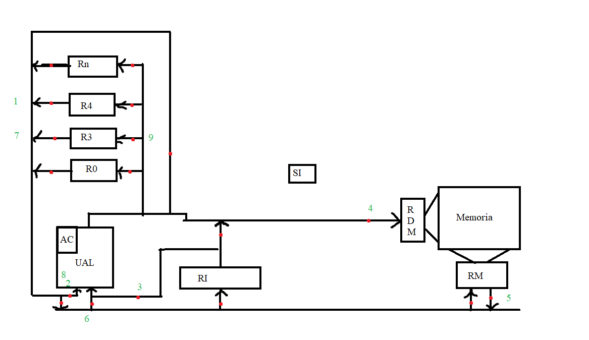

## Explique claramente que es y cómo funciona el modo de direccionamiento post-indexado autoindexado (registro indirecto con post-incremento) en la arquitectura ARM de 32 bits. De un ejemplo concreto con una instrucción.

Un ejemplo concreto de instrucción es: `LDR R0, [R1], #4`.

Es un modo de direccionamiento que sirve para acceder al contenido en memoria de un registro que contiene una dirección de memoria para luego, una vez que se lee el contenido de la memoria en el registro, se incrementa una cantidad fija de lugares.

Para explicar el funcionamiento de este modo de direccionamiento, voy a usar la instrucción que usé para ejemplificar. Se copia en el registro `R0` el contenido apuntado por la dirección de memoria en `R1`. Una vez copiado en `R0`, se incrementa en `4` la dirección en `R1`.

## Indique como se puede clasificar el repertorio de instrucciones de una arquitectura de computadores de acuerdo al número de direcciones. Ejemplifique cada una.

Se pueden clasificar según si tienen 0, 1, 2 o 3 direcciones:

- 0 Direcciones (Stack): no hace falta agregarle operandos a la intrucción, ya que están dados de manera implicita. Por ejemplo, la instrucción `ADD`, que suma el tope de la pila con el anterior.

- 1 Dirección (Acumulador): igual que en la máquina ABACUS. Todas las operaciones se realizan contra el acumulador. Por ejemplo `ADD A`, siendo `A` un dato en memoria.

- 2 Direcciones: requiere dos operandos que pueden ser combinaciones de registro-memoria. La arquitectura Intel x86 en algunas instrucciones, tal como `ADD RAX, RBX`.

- 3 Direcciones: típico de la arquitectura ARM, donde el primer operando es donde se la a copiar el resultado de la instrucción y los últimos dos registros son aquellos con los que se va a operar. Por ejemplo, la instrucción de ARM `MUL R0, R1, R2`.

## ¿Cuáles son las ventajas y desventajas del nivel 6 de la arquitectura de discos RAID respecto al nivel 5? ¿En qué casos se usaría cada uno? Grafique la distribución de la información en los discos en ambos niveles.

Ventajas del Nivel 6:
- Más tolerante ante fallos (tiene tolerancia de rotura de dos discos, a diferencia del nivel 5 que solo tolera una rotura).
- Disponibilidad de Datos: el nivel 6 de discos Raid tiene una mayor disponibilidad de datos gracias a ese disco extra.

Desventajas del Nivel 6:
- Mas caro: requiere un disco más.
- Controlador más complejo: al tener más strips de paridad, el controlador es más complicado.

El nivel 5 se suele usar cuando la disponibilidad de datos no es un tema primordial y no se justifica el gasto en un disco extra y cuando la rotura de un disco no representa un problema crítico.

El nivel 6, en cambio, se usa cuando la disponibilidad de datos es un aspecto de primer orden. Acá entra en juego ese disco de paridad extra. 


## Indique gráficamente en el esquema de la máquina Abacus cuál es la compuerta que permite que se cumpla el principio de ruptura de secuencia de Von Neumann. De un ejemplo de una instrucción Abacus en donde se aplique este principio.

La compuerta que permite que se cumpla el principio de ruptura de secuencia de Von Neumann es aquella que entra al RPI. Esto se debe a que, si se cambia por algún motivo externo la normal ejecución del programa, se estaría rompiendo la secuencia del programa.

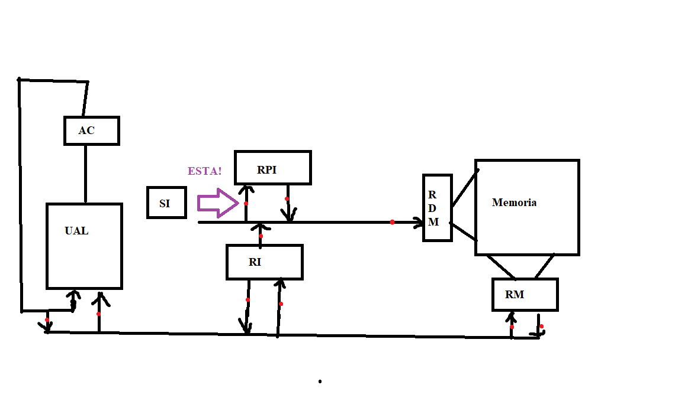

Un ejemplo de instrucción donde se cumple este principio es ante cualquier bifurcación, como lo es `8300`, que simboliza bifurcar a la celda 300 si el contenido del acumulador es mayor a cero.

## En la arquitectura ARM de 32 bits, ¿a qué se denomina ejecución condicional de una instrucción? De un ejemplo de su uso en assembler.

En la arquitectura ARM, la ejecución condicional es una característica que poseen las intrucciones, las cuales permiten ser ejecutadas, sí y solo sí, se cumple la condición de algún flag en particular. Esta característica es especialmente útil, ya que evita hacer branchs, haciendo el código más rápido y mantenible.

Un ejemplo es la instrucción `MOVEQ R0, #5`, la cual copia el inmediato `5` al registro `R0` si la zero flag está encendida.

## ¿Qué limitaciones y qué ventajas plantea el modo de direccionamiento por registro? De un ejemplo de su uso en una arquitectura que conozca.

Las ventajas del modo de direccionamiento por registro es la velocidad que garantiza, ya que el movimiento de datos entre registro es la manera más veloz de transportar información. Otra ventaja es la reubicabilidad, ya que no se depende de direcciones de memoria que pueden variar según cada ejecución.

Las desventajas son que es un modo de direccionamiento bastante limitado en espacio (los registros tienen una capacidad fija). Otra limitación es que hay pocos registros de uso general.

Un ejemplo de su uso en una arquitectura puede ser la arquitectura Intel x86. Una instrucción de ejemplo es `MOV RAX, RBX`.

## Indique claramente cuáles son las acciones que realiza un ensamblador específicamente en la segunda pasada del proceso de ensamblado. ¿Qué información usa de la primera pasada para realizar parte de dicho proceso? ¿Para qué usa y cómo usa dicha información?

En la segunda pasada del proceso de ensamblado el ensamblador combierte constantes a binarios, asigna registros y direcciones de memoria a los datos usados en el programa y utiliza la tabla de símbolos obtenida en la primera pasada tras analizar las instrucciones y sus longitudes. Esta tabla contiene las direcciones de cada instrucción en base a un Program Counter iniciado en 0 al inicio del módulo. Lo que se hace en la segunda pasada con esta tabla es resolver las referencias a otras etiquetas usado estas informaciones. Esto se hace para facilitar la localización de las instrucciones y, de esta manera, resolver las referencias a otros módulos.

## Explique claramente que es un ciclo de instrucción en un procesador, indique qué etapas contempla y que ocurre durante la ejecución de cada una de ellas.

El ciclo de instrucción en un procesador es el proceso que se lleva a cabo cada vez que se necesita ejecutar una instrucción. Este ciclo puede describirse en cinco etapas:

* Instruction Fetch: el procesador captura desde la memoria del computador la instrucción a ejecutar.

* Instruction Decode: a partir de los bits que componen a la instrucción, obtener el tipo de operación a realizar y los operandos necesarios. Se obtiene el código de operación (opcode) de la instrucción, el cual puede variar a pesar de que dos instrucciones puedan tener el mismo mnemónico, principalmente por los modos de direccionamiento usados.

* Operand Fetch: es el proceso de extraer los operandos de la instrucción.

* Execute: una vez se cuenta con el código de opación y los operandos, se lleva a cabo la ejecución de la instrucción.

* Write-Back: almacena en el registro destino el resultado de la ejecución de la instruccón.

## Identifique y explique cuáles son las principales desventajas del medio de almacenamiento en cinta. ¿Cuáles son sus aplicaciones actuales? ¿Qué ventajas comparativas tiene con respecto al resto de los medios de almacenamiento secundario?

Las desventajas de este medio son varias:

* Acceso Secuencial: esto hace que para acceder a un registro específico, primero se deben pasar por todos los registros intermedios.

* Necesidad de Rebobinar: si queremos acceder a un registro ya visitado, es necesario rebobinar la cinta, pasando por datos que no nos interesan.

* Lentitud: los tiempos de lectura y escritura son los peores en comparación con los otros medios en la jerarquía de memoria.

Hoy en día se sigue usando para back-up y archivo de datos a largo plazo.

Las ventajas son:

* Tecnología madura y muy probada: al ser el medio de almacenamiento más añejo, hay mucha información al respecto de ellos y se sabe que es una tecnología que funciona muy bien.

* Alta capacidad de almacenamiento: de hasta 30TB por cartucho, muy superior a los otros medios como los HDD, los cuales pueden soportar hasta 12TB.

* Alta durabilidad: pueden durar hasta 30 años si se preservan en codiciones ideales.

* Bajo costo por byte.

## En un sistema de memoria, ¿qué función cumple la memoria cache? ¿En qué principio se basa su efectividad? Grafique un ejemplo de arquitectura de cache de 3 niveles.

La memoria caché cumple la función de mejorar el rendimiento general de un computador, mediante el uso de memorias semiconductoras ubicadas estratégicamente entre la CPU y la memoria principal. Se basa en el principio de localidad de referencia, el cual indica que las referencias a memoria se agrupan en tiempo y espacio. En líneas generales, el funcionamiento es el siguiente: la CPU necesita buscar un dato. Lo primero que hace es fijarse si está en la caché. Esto lo puede hacer rápidamente, ya que la caché puede buscar asociativamente. Si está en la caché el dato, lo trae a la CPU. Si no está, lo va a buscar a la memoria principal, pero no se va a traer solo ese dato, sino el bloque de memoria en donde se encuentra ese dato (usando de esta forma el principio de localidad de referencia) va a ser incorporado a la caché.

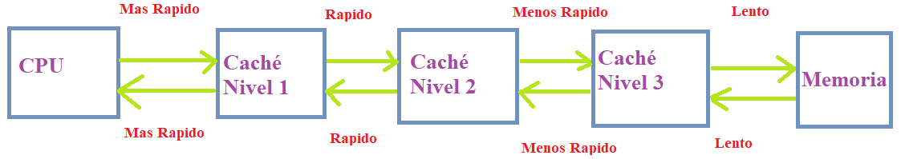

## Explique claramente cuáles son los eventos temporales presentes a la hora de almacenar o recuperar información en un disco magnético sectorizado. Indique como se calcula cada uno de ellos. Otra de otro final: Especifique como haría el cálculo de lectura de un archivo con una distribución aleatoria de la información en el disco.

Eventos temporales presentes a la hora de almacenar o recuperar información en un disco magnético sectorizado:

* Tiempo de Seek: usualmente el mas lento. Es el tiempo que tarda la cabeza lectora/grabadora en posicionarse sobre la pista a operar.

* Latencia Rotacional: es el tiempo que tarda la cabeza lectora/grabadora el posicionarse sobre el sector a operar una vez que está sobre el sector buscado. Se obtiene como $\frac{1}{2r}$, siendo $r$ la velocidad de rotación en RPS.

* Tiempo de acceso: es el tiempo que tarda el disco en total en ubicarse en el sector a transferir. Se obtiene como la suma del tiempo de seek y la latencia rotacional

* Tiempo de Transferencia: es el tiempo que se demora en realizar una transferencia de datos. Se calcula como: $\frac{b}{rN}$, siendo $b$ la cantidad de bytes a transferir, $r$ las revoluciones por segundo y $N$ la densidad de bytes por pista.

El tiempo promedio $T_n$ que se tarda en transferir $n$ bytes es:

$$T_n = T_{seek} + \frac{1}{2r} + \frac{b}{rN}$$

La otra: hay que repetir el proceso anterior, pero por cada sector del disco. Sean $S$ la cantidad de sectores del archivo, el tiempo queda:

$$T_n = S \left( T_{seek} + \frac{1}{2r} + \frac{b}{rN} \right) $$

## Explique claramente si es posible implementar en la máquina SuperAbacus la instrucción SUMAR DI(RI), DII(RII) donde DI, RI y DII, RII hacen referencia a dos operandos de memoria. Justifique su respuesta usando el gráfico de la máquina.

Es posible implementarla, pero no en una sola instrucción. Esto se debe al formato de instrucción que admite la máquina SuperABACUS, la cual se compone de un mnemónico, primer operando que es un registro y un segundo operando que es otro registro mas un determinado desplazamiento u offset. Una manera de implementar esta instrucción es primero acceder al contenido en memoria de uno de los dos operandos, guardar ese contenido en un registro de uso general, para luego realizar la operación usando el modo de direccionamiento de registro indirecto mas desplazamiento. 

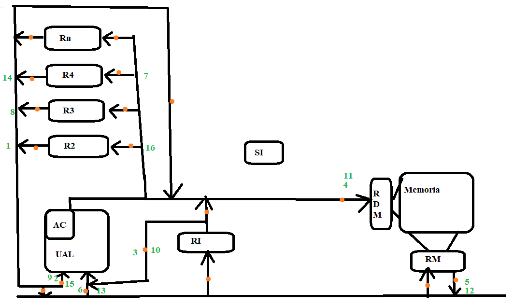

```
SUMAR 20(2),30(3)
(R2) -> AC
(AC) + 20[16] -> AC
(AC) -> RDM
((RDM)) -> RM
(RM) -> R4
(R3) -> AC
(AC) + 30[16] -> AC
(AC) -> RDM
((RDM)) -> RM
(RM) -> AC
(AC) + (R4) -> AC
(AC) -> R2
```

## Mencione al menos 3 modos de direccionamiento presentes en la arquitectura Intel x86 dando un ejemplo de uso de cada uno en una instrucción.

* Modo de Direccionamiento Implicito: no lleva operandos explicitos, ya que la instrucción contiene implicitamente los operandos. Ejemplo: `CBW`, el cual convierte un byte en `AL` a una palabra en el registro `AX`.

* Modo de Direccionamiento Inmediato: se tiene como primer operando a un registro y como segundo operando un dato inmediato. Un ejemplo puede ser la instrucciónm `MOV RAX, 5`, que copia al registro `RAX` el valor entero `5`.

* Modo de Direccionamiento Registro Directo: se tiene como operandos dos registros, con los cuales se va a operar. Ante una operación, el resultado de la misma va a quedar plasmado en el primer regustro. Ejemplo: `ADD RAX, RBX`.

## ¿Qué ventajas provee la administración de memoria paginada frente a otros mecanismos más sencillos? ¿Qué desventaja presenta frente a la administración paginada por demanda?

En la administración de memoria paginada, la memoria interna de un proceso se ve como un conjunto de páginas, que son particiones fijas de memoria. La memoria de un computador se ven como particiones llamadas frames. En este mecanismo, cuando se ejecuta un proceso, se cargan sus páginas a los frames de la computadora. Frente a otros mecanismo más elementales, existen varias ventajas. En comparación con los sistemas asociados a la uniprogramación, la mayor ventaja es la posibilidad de correr más de un proceso en simultaneo. En relación con otros mecanismos asociados a la multiprogramación, las ventajas son la minimización de la fragmentación interna (la cual puede ocurrir solo en la última página de cada proceso) y la eliminación total de la fragmentación externa.

La desventaja más destacable frente a la administración paginada por demanda es la necesidad de carga todas las páginas de un proceso en los frames. En la administración por demanda solo se cargan las páginas necesarias, mejorando la eficiencia del sistema.

## En la arquitectura de discos RAID de nivel 3: ¿qué ocurre si un disco queda inutilizable? Explique el algoritmo que permite recuperar la información perdida.

Si un disco queda inutilizable, el sistema seguiría funcionando de la misma forma, ya que en los sistemas RAID 3 se cuenta con un disco de paridad extra, con el cual vamos a poder reconstruir la información cualquier otro disco.

El algoritmo de recuperación es bastante sencillo. Sea $X_4$ el disco de paridad y $X_i, i \in \mathbb{I}_3$ discos que contienen datos. Sabemos que:

$$ X_4 = X_1 \oplus X_2 \oplus X_3 $$

Siendo $\oplus$ la operación XOR. Si queremos recuperar el disco $X_3$, aplicamos XOR de todos los discos de datos que no son $X_3$ a ambos lados

$$ X_4 \oplus (X_1 \oplus X_2) = X_1 \oplus X_2 \oplus (X_1 \oplus X_2) \oplus X_3 $$

$X_1 \oplus X_2 \oplus (X_1 \oplus X_2)$ se cancela.

$$ X_4 \oplus X_1 \oplus X_2 = X_3 $$

De esta manera recuperamos $X_3$.

## Explique cuál es el principio de grabación de un CD-R y cuál es la diferencia con la grabación de un CD-ROM.

Los CD-R son medios ópticos que permiten ser grabado únicamente. A la hora de ser grabados, estos discos cuentan con una capa de tinta, la cual, mediante el uso de un laser, se quemar para simular lo que serían los pits. Las partes no quemadas representan los land.

La diferencia con la grabación de un CD-ROM es que estos se graban los pits en un disco "master", se hace un molde a partir de este y se le inyecta policarbonato.

## ¿Cuáles son las ventajas y desventajas de la arquitectura Harvard con relación a la arquitectura Von Neumann? ¿En qué casos tiene aplicabilidad la arquitectura Harvard? Grafique ambas arquitecturas y justifique.

Ventajas de la Arquitectura Harvard:

* Rendimiento: como los datos e instrucciones se manejan por separado, se permite aumentar el ancho de banda del computador, y de esta manera, el rendimiento.

* Predecibilidad: al manejarse en memorias y buses difentes, las transferencias de datos no se ven afectadas por transferencias de instrucciones y viseversa. Esto es especialmente útil es straming de datos.

Desventajas de esta arquitectura:

* Complejidad: el hecho de tener dos meorias separadas para instrucciones y datos y dos buses distintos, hace que esta arquitectura sea más compleja y también más cara.

* Programación difícil: al tener dos memorias, se manejan distintos direccionamientos de memoria. Esto dificulta la programación.

La arquitectura Harvard puede ser aplicable en microcontroladores PIC y procesadores de señales digitales.

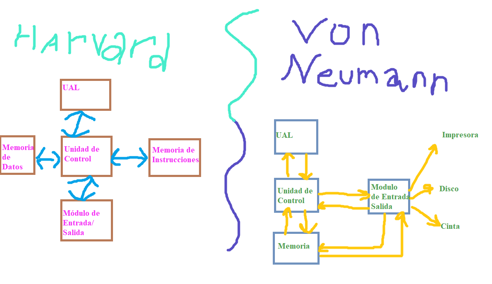

## Explique claramente y ejemplifique al menos cuatro modos de direccionamiento presentes en la arquitectura ARM 32 bits.

* Modo de Direccionamiento Inmediato: consite en cargar en un registro un determinado dato inmediato presente en la instrucción. Ejemplo: `MOV R0, #4`, que copia el valor `4` al registro `R0`.

* Modo de Direccionamiento Registro Directo: son instrucciones las cuales tienen como operandos dos registros. Las operaciones se realizan con los contenidos de estos registro. Ejemplo: `MOV R0, R1`, que copia al registro `R0` lo que está en `R1`.

* Modo de Direccionamiento Registro Indirecto: en este modo de direccionamiento un registro debe tener cargada una dirección de memoria. Este manera de direccionar deja en el primer operando el contenido de la direccion de memoria del segundo registro. Ejemplo: `LDR R0, [R1]`, que copia en `R0` lo que es apuntado en la dirección de memoria contenida en `R1`.

* Modo de Direccionamiento Registro Indirecto Con Offset: se cuenta con un registro que posee una dirección de memoria. También contamos con un offset o desplazamiento fijo. Lo que hacemos es copiar en un registro el contenido de la memoria mas el desplazamiento. Un ejemplo de instrucción de la arquitectura ARM es: `LDR R0, [R1, #4]`. Supongamos que en `R1` está la dirección de memoria `0x10`. Lo que hacemos es copiar en `R0` lo apuntado en `0x14`.

## Indique al menos 4 características que identifiquen a los procesadores de la arquitectura ARM como procesadores RISC. De ejemplos de esas características en dicha arquitectura.

* Acceso a Memoria Limitado: los accesos a memoria se realizan a traves de solo dos intrucciones: `LDR` y `STR`. Como por ejemplo `LDR R0, =variable`. En los procesadores CISC, como Intel x86, se puede acceder a memoria desde casi cualquier intrucción, como `ADD RCX, QWORD[VAR]`.

* Instrucciones simples: las instrucciones de los procesadores RISC se ejecutan en un solo ciclo de reloj. Las instrucciones complejas de los procesadores CISC tardan más. Una de las causas de esto es que pocas instrucciones acceden a memoria y el resto operan directamente con registros, evitando la complejidad adicional de manejar accesos a memoria desde la instrucción. En Intel x86, ejecutar la instrucción `ADD RAX, QWORD[VARIABLE]` es mucho más complejo que ejecutar en ARM `ADD R0, R1, R2`.

* Formato de Instrucción Fijo: todas las instrucciones ARM tienen el mismo tamaño: 32 bits. A diferencia de las intrucciones de Intel x86, las cuales pueden variar según la complejidad. Por ejemplo, en ARM ocupan los mismo `MOV R0, R1` y `MUL R0, R1, R2`.

* Muchos Registros de Uso General: se cuenta con una cantidad considerable de registros de uso general. Trece en total, contando desde `R0` hasta `R12`.

## Explique claramente cómo funciona el linking estático. Ejemplifique y grafique dicho funcionamiento.

El linking estático es una manera de enlazar (combinar varios módulos objeto en un único archivo cargable) el cual funciona creando un único load module, el cual alberga el contenido de todos los módulos objetos, creando un archivo cargable más pesados que los generados dinámicamente, pero que tiene las ventaja de ser más rápido y tener todas las referencias resultas al momentos de llevar a cabo el loading (rutina que lleva a memoria principal el programa a ejecutar).

Este load module se crea usando una tabla de módulos y las longitudes de cada módulo, sumandole a las instrucciones que referencian a memoria un constante de reubicabilidad y a las instrucciones que referencian a otros módulos se las remplaza por la ubicación en el load module a ese módulo específico.

Para ejemplificar y graficar el linking estático voy a proponer un ejemplo de tres módulos: A, B y C. Uno tiene un salto a una parte del mismo módulo y hay un módulo que referencia al otro. Se puede ver que en el load module se unifican todos y se adaptan las referencias de manera tal que el programa siga andando.

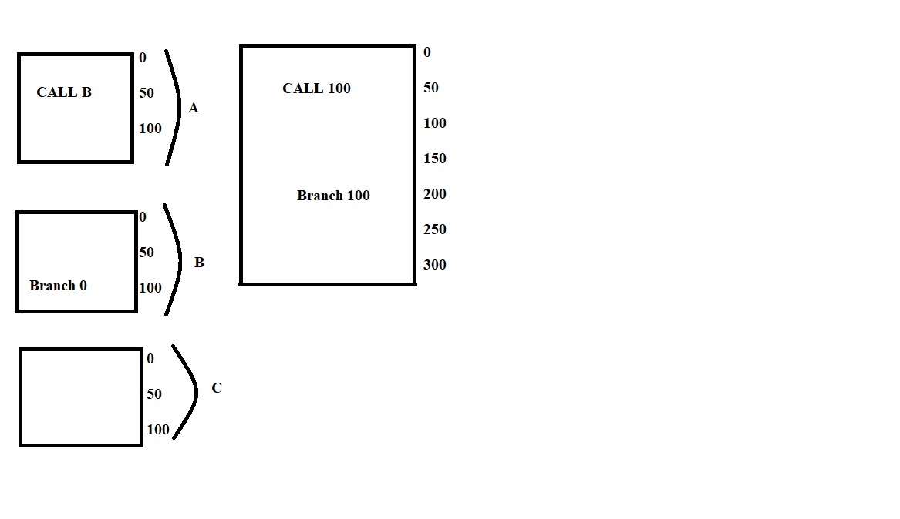

## ¿Qué es un "page fault" y cuándo ocurre? Indique cómo y quién lo gestiona.

En los sistemas de administración de memoria paginados por demanda, donde la memoria de un proceso es vista como una colección de particiones de tamaño fijo llamadas páginas y la memoria interna del computador se divide en frames, cuando se ejecuta un proceso, se sube a los frames del sistema las páginas necesarias para la ejecución del proceso. Si es intenta acceder a una página que no está subida a los frames del sistema, se ocaciona un page fault. Esta es una interrupción atendida por el sistema operativo, concretamente por el page fault handdler, la cual se encarga de llevar a los frames la pagina que no está, pero se quiso acceder. Si hay frames libres, simplemente se cargan las páginas. Si no hay frames libres, se bajan a memoria secundaria páginas para liberar espacio en un proceso llamado page swapping.

## Indique cuales son las microinstrucciones necesarias para las fases de búsqueda y ejecución de la instrucción SUMAR 300 en la máquina Abacus, siendo 300 la dirección de una celda en base 16. Se pide además graficar en el esquema de la máquina el flujo de apertura de compuertas usadas en ambas fases de dicha instrucción.

### Fase de Búsqueda

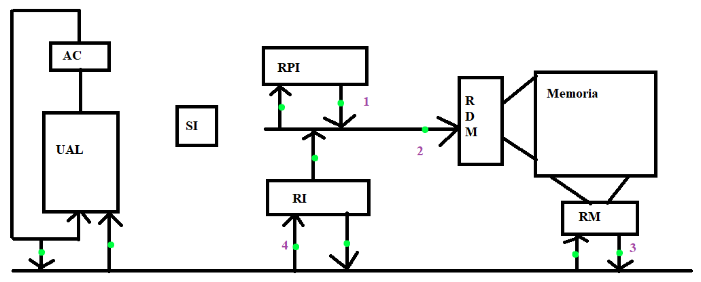

```
Fase de Busqueda
(RPI) -> RDM
((RDM)) -> RM
(RM) -> RI
(RPI) + 1 -> RPI    <-- Incremento Via SI
```

### Fase de Ejecución de SUMA 300

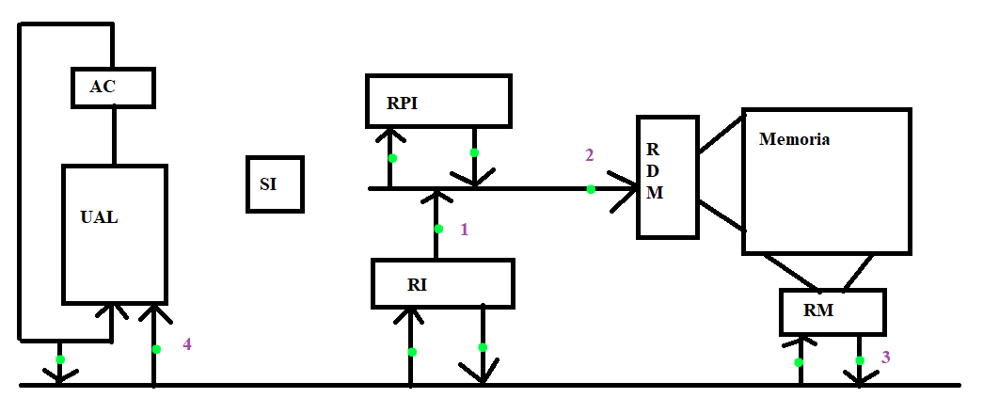

```
SUMAR 300
(OP) -> RDM
((RDM)) -> RM
(RM) + (AC) -> AC
```

## Indique claramente que es el linking dinámico en tiempo de carga y cuáles son las diferencias frente al linking estático.

El linking dinámico en tiempo de carga es una forma de enlazar programas (combinar varios códigos objeto en un solo load module) que se caracteriza por postergar al tiempo de loading las referencias a otros módulos. En este proceso, lo primero que se hace es generar un load module, el cual aún no tiene las referencias a otros módulos resueltar. Luego, el loader carga a memoria el load module. A medida que se realiza el proceso de loading, cuando se encuentra una referencia no resuelta, recién en ese momento se resuelve dicha referencia. Una vez resulta esta referencia, se continua este proceso hasta que no haya más referencias. Una vez concluida la fase de loading, el programa ya está listo para ejecutarse con todas las referencias a otros módulos resueltas.

El linking estatico presenta diferencias importantes. En este, se juntan todos los módulos objeto en uno solo load module. Para generar este load module, se necesita crear una tabla con todos los modulos y sus longitudes, luego todas las referencias a memoria se resuelve sumando el offset que le corresponde a cada módulo y las referencias a otros múdulos se resuelven remplazando la direccion en el nuevo load module. Esto resulta en un ejecutable más pesado, pero con todas las referencias resueltas. Esto también hace que, ante modificaciones a algún módulo, se tenga que volver a enlazar.

## En un sistema de memoria, ¿a qué se denomina jerarquía de memoria? Indique claramente los elementos que la componen y las características que identifican a cada uno. Grafíquela.

Jerarquía de memoria es la manera en la cual se categorizan los distintos medios de almacenamiento según criterios como capacidad, costo y tiempo de acceso. Se puede graficar como una pirámide, donde en la cúspide se encuentra el medio más rápido, costoso y escaso de todos: los registros. Luego, mientras vamos descendiendo en ella, podemos ir notando que la capacidad va creciendo, el costo va bajando y el tiempo de acceso es más lento.


* Registros: memoria semiconductora en la cúspide de la piramide. Es la memoria más rápida, cara y escasa de todo el sistema de memoria.

* Caché: memoria semiconductora con método de acceso asociativo, ubicada estratégicamente entre la CPU y la memoria principal. Su fin es mejorar el rendimiento del computador. Su funcionamiento se basa en el principio de localidad de referencia, que dice que los bloques de memoria se agrupan en tiempo y espacio.

* Memoria Principal: memoria semiconductora volátil con método de acceso aleatorio, la cual almacena la información de los programas que se están ejecutando.

* SSD: memoria no volátil y sin partes mecánicas, lo que lo hace más silencioso y genera menos calor que los discos HDD, pero con un costo mayor a estos. Se usan celdas NAND para almacenar la información a largo plazo.

* HDD: memoria no volátil con método de acceso directo. Presenta un costo por byte menor al SSD. También brinda una mayor capacidad por disco (de hasta 12TB). Sus contras son el mayor consumo de energía, las partes mecánicas que generan ruido y calor, la velocidad en operaciones de lectura/escritura en comparación con los SSD y la sensibilidad ante caidas o golpes. Una ventaja que estos discos tienen es la facilidad de recuperación de información ante fallas.

* Medios Ópticos: memoria no volátil, con una estructura compacta, ideal para la distrubución de contenido multimedia a gran escala. El precio por unidad de bajo. Sus desventajas son las limitada capacidad por unidad (50GB en los discos Blu-Ray) y la velocidad de lectura/escritura bajas.

* Cintas Magnéticas: memoria con método de acceso secuencial, muy usado para back-up y archivo de información a largo plazo. El precio por byte es el más competitivo de toda la escala, brindando también una gran capacidad por cartucho (de hasta 30TB) y una buena vida útil (de hasta 30 años si se guarda en condiciones buenas). La mayor desventaja es el tiempo de lectura, dado por su método de acceso.


## ¿Cuáles son las ventajas del nivel 5 de la arquitectura de discos RAID con respecto al nivel 4? ¿En qué casos lo usaría? Grafique la distribución de la información en los discos en ambos niveles.

El nivel 5 distribuye los strips de paridad en todos los discos, solucionando el cuello de botella del nivel 4 que se daba por tener todos los strips de paridad en un solo disco. La desventaja del nivel 5 es la complejidad del controlador.

Se lo puede usar en situaciones de servidores intranet o servidores de bases de datos.


## ¿Por qué se dice que los formatos de instrucción de la arquitectura Intelx86 son variables? De algún ejemplo que justifique su respuesta. 

Los formatos de la arquitectura Intel x86 son variables, ya que las instrucciónes de esta arquitectura se arman concatenando una serie de campo, los cuales algunos son opcionales o directamente no están disponibles para otras instrucciones, tales como opcodes, inmediatos, accesos a memoria, entre otros, de manera tal que mientras más campos tenga una instrucción, más compleja y pesada es. Por ejemplo, la instrucción `MOV RAX, RBX` es mucho más sencilla que `IMUL RAX, RBX, 12`. Esto es porque en el caso de la primero, solo se copia el contenido de `RBX` en `RAX`. En cambio, en la segunda se hace una multiplicación en la cual se debe multiplicar un inmediato por un registro para luego almacenar el resultado en `RAX`. Esto hace a la instrucción de multiplicación más compleja que la primera.

## ¿Cuáles son las limitaciones de la administración de memoria por asignación particionada en relación al resto de los mecanismos más avanzados? 

En la administración de memoria por asignación particionada se divide la memoria del computador en particiones de tamaño fijo, asignandole a un programa una de esas particiones. Este método presenta limitaciones frente a los más avanzados: no habilita la implementación de privilegios, no permite compartir información entre procesos y no usa eficientemente los recursos, manifestandose en la forma de fragmentación interna (el proceso no usa la totalidad de la memoria asignada para él) y fragmentación externa (hay particiones de memoria que no están siendo usadas por ningín proceso).

## ¿Qué ventajas incorporan los canales o procesadores de E/S a los mecanismos más básico de interconexión de dispositivos periféricos con el computador?  

* Autonomía: la CPU le delegan a estos elementos la capacidad de ejecutar tareas de entrada/salida.

* Capacidad de ejecutar un programa de E/S completo de forma autónoma.

## Mencione al menos 2 desventajas que aun hoy persisten en los discos SSD frente a los discos duros mecánicos.

* Precio: el costo por byte es notoriamente más alto en los discos SSD en relación con los discos HDD.

* Recuperación de datos: en situaciones en las cuales el SSD sufre un daño físico, la recuperación de datos es más difícil en los discos SSD con respecto a los HDD.

## ¿Cómo funciona el mecanismo de inhibición de interrupciones y para que se usa? ¿Qué desventaja tiene? 

El mecanismo de inhibición de interrupciones procesa secuencialmente interrupciones según su orden de llegada. El mecanismo consiste en inhibir el procesamiento de una interrupción si en el momento de llegada ya se está procesando una, dejandolá para procesar a lo último. Por ejemplo, si primero llega la interrupción A, luego la B y, por último, la C, se procesa en este orden: A, B, C. El uso que tiene es mantener un orden y consistencia a la hora de procesar interrupciones. La gran desventaja de este método es que no tiene en cuenta la prioridad de las interrupciones.

## ¿Qué ventajas presenta el modo de direccionamiento por desplazamiento (relativo al PC/referencia al programa) frente al direccionamiento directo?

Ventajas del modo de direccionamiento por desplazamiento frente al direccionamiento directo:

* Acceso a Datos: permite acceder a datos cercanos a la instrucción que se está ejecutando de una manera muy sencilla. Por su parte, en el direccionamiento directo se debe contar con el dato específico en un área específica de la memoria para poder acceder a el mismo

* Reubicabilidad: como en cada ejecución las direcciones en memoria de las variables cambia, el modo de direccionamiento por desplazamiento no se ve afectado por este aspecto, a diferencia del direccionamiento directo, ya que todos los accesos a memoria se realizan relativos al Program Counter.

## Explique cuáles son los modos de direccionamiento, formatos de instrucción y tipos de datos presentes en la maquina Súper Abacus. De ejemplos de cada uno de ellos. 

Modos de direccionamiento en SuperABACUS:

* Modo de direccionamiento inmediato: ejemplo de instrucción `SUMAR 1, 100`. Suma al registro `R1` el inmediato `100`.

* Modo de direccionamiento registro directo: ejemplo de instrucción: `SUMAR 1, 2`. Suma al registro `R1` lo que está almacenado en `R2`.

* Modo de direccionamiento registro indirecto: ejemplo de instrucción: `SUMAR 1, (2)`. El registro `R2` contiene una dirección de memoria. Se le suma al registro `R1` el contenido de memoria apuntado por `R2`.

* Modo de direccionamiento registro indirecto mas offset: ejemplo de instrucción: `SUMAR 1, 5(2)`. El registro `R2` contiene una dirección de memoria. Le sumamos `5[16]` a la dirección de memoria en `R2`. Por ejemplo, si en `R2` está `0x10`, le sumamos `5[16]`, por lo tanto, en `R2` nos queda `0x15`, vamos a acceder al contenido en esa dirección de memoria y se lo vamos a sumar al contenido de `R1`.

Formato de Instrucción: las instrucciones de SuperABACUS se componen de un mnemónico y dos operandos, El primero de ellos un registro y el segundo un registro mas un offset. Por ejemplo, en el caso de la instrucción `SUMAR 1, 5(2)`, el mnemónico es `SUMAR`, el primer operando es el registro `R1` y el segundo operando es el registro `R2` mas un offser de `5[16]`.

Tipos de Datos:

* Números Enteros: son números enteros en base 10 para realizar operaciones aritmético-lógicas, como por ejemplo el inmediato `100`.

* Direcciones de Memoria: son números en base 16 que hacen referencia a sectores de memoria. Un ejemplo de dirección puede ser `0x14`.

## Explique claramente qué es el fenómeno de “thrashing” y qué lo puede originar.

En el contexto de la administración de memoria páginada por demanda, donde la memoria de un proceso es estructurada en una serie de particiones fijas llamadas páginas y la memoria de la computadora se ve como una serie de particiones llamadas frames, cuando se ejecuta un programa, solo se cargan a los frames las páginas necesarias para ese proceso. Cuando se quiere acceder a una página no presente en los frames, se produce un page fault: una interrupción manejada por el page fault handdler, la cual se encarga de llevar a los frames la página que necesitamos. Si hay frames libre, se lleva la página directamente. Si no hay frames libres, se lleva a memoria secundaria algunas páginas para hacer lugar, en el proceso conocido como page swapping. El “thrashing” se ocaciona cuando la CPU gasta mas recursos en hacer page swapping que en realizar operaciones verdaderamente útiles.

Este fenomeno se puede originar por el hecho de tener muchos procesos corriendo en simultaneo, lo cual hace que se agoten los frames disponibles.

## Mencione al menos 3 ventajas de los discos SSD frente a los discos duros mecánicos.

* Carencia de Partes Mécanicas: esto evita problemas como el calor y ruido.

* Velocidad: los discos SSD son mucho más rápidos en operaciones de lectura y escritura.

* Mas Resistentes: los discos SSD toleran mucho mejor caidas y golpes que los HDD.

## ¿Qué mecanismos provee el estándar IEEE 754 para el manejo de operaciones matemáticas con resultados indeterminados o indefinidos? De ejemplos de dichas operaciones e indique cuál sería la configuración en el formato para representar dichos resultados.

El estándar IEEE 754 provee los NaN, o "Not a Number" para estos casos. Ejemplo de operaciones que resulten en NaN son: cualquir operación contra NaN o infinito menos infinito. La configuración en el formato para representar dichos resultados son con todos 1 en el exponente y mantisa con bits distintos de cero.

## Enuncie al menos 4 características de la arquitectura de procesadores CISC.

* Caracteríticas de la ISA: el set de instrucciones amplio y complejo, no como en los procesadores RISC, que se caracterizan por tener, tal como lo dice el nombre, un set de instrucciones reducido.

* Tiempo de ejecución de instrucciones: las instrucciones de procesadores CISC se pueden ejecutar en más de un ciclo de reloj.

* Orientación: los procesadores CISC están más orientado al hardware, a diferencia de los procesadores RISC, que están orientados al software.

* Formatos de Instrucción: los procesadores CISC suelen manejar instrucciones de formato variable.

## ¿Cuáles son las ventajas del nivel 1 de la arquitectura de discos RAID respecto al nivel 0? Grafique la distribución de la información en los discos en ambos niveles.

Ventajas:

* Alta disponibilidad de datos: como cuenta con dos discos con exácamente el mismo contenido.

* Muy tolerante a falla de discos: por el hecho de contar con espejamiento de datos.

* Operaciones de lectura y escritura se realizan en ambos discos sin penalizar performance.

* Se pueden hacer operaciones de lectura/escritura desde cualquiera de los dos discos.

Gráfico para el caso de $N = 2$ discos. Notar que RAID 1 requiere $2N$ discos.

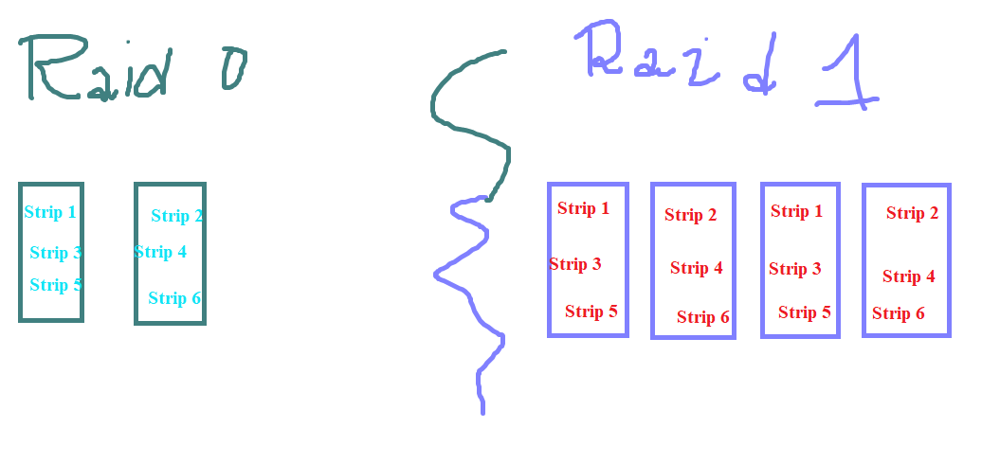

## Enumere por lo menos 4 elementos presentes en la arquitectura de programación (ISA) de un computador. Dé ejemplos de dichos elementos en alguna de las arquitecturas vistas en clase.

* Repertorio de Instrucciones: todas las instrucciones que podemos usar como programadores de bajo nivel, como `MOV`, `IMUL` y `CBW` de la arquitectura Intel x86.

* Modos de Direccionamiento: diferentes formas a las cuales podemos acceder a datos desde una instrucción (como los modos de direccionamiento inmediato o registro indirecto de la arquitectura ARM).

* Tipos de Datos: son los tipos de datos con los cuales se pueden operar (como números enteros y números de punto flotante presentes en la arquitectura Intel x86).

* Endianess: hay arquitecturas que son little endiand (como Intel x86) o big endian (IBM Mainframe).


## Explique claramente cuáles son las ventajas y desventajas de la organización tradicional de discos magnéticos versus la organización multizona. Grafique ambas organizaciones.

Ventajas: 

* Simplicidad: poseen una mecánica y electrónica más sencillo.

* Rendimiento: tiempos de acceso rápidos y transferencias predecibles.

Desventajas:

* Desperdicio: como los bytes exteriores están más alejados, no se llegan a aprobechar en su totalidad.

* Menor Capacidad Total.

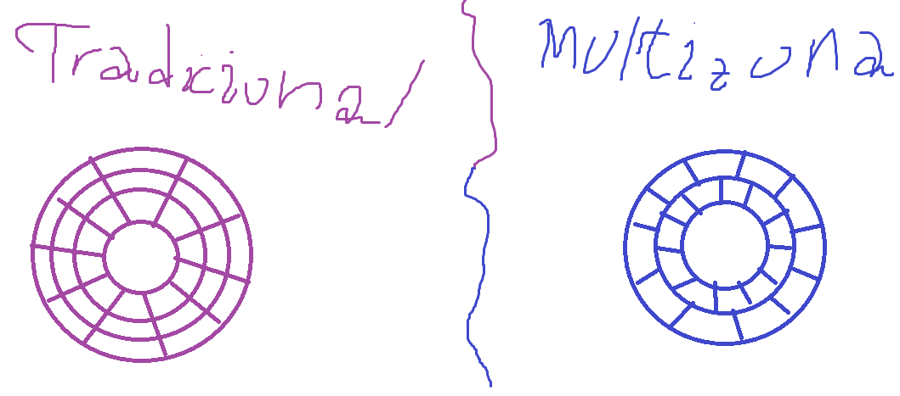


## Indique como se puede clasificar el repertorio de instrucciones de una arquitectura de computadores de acuerdo a la ubicación de los operandos. Ejemplifique y/o grafique cada uno.

Se pueden clasificar de cinco maneras:

* Pila: los operandos se encuentran en el stack. Ejemplo de instrucción: `ADD` (suma el TOS con el anterior).

* Acumulador: como el ABACUS. Todas las operaciones se realizan contra el acumulador y el resultado queda allí. Ejemplo: `ADD A`, siendo `A` un dato en memoria.

* Registro-Memoria: ejemplo de Intel x86: `MOV RAX, QWORD[VARIABLE]`. Consiste de dos operandos. El primero es un registro y el segundo un operando en memoria. En este caso, se copia en el registro `RAX` el contenido de la memoria `VARIABLE`.

* Registro-Registro: ejemplo de ARM: `MOV R0, R1`. Los dos operandos son registros. En este caso, se copia el contenido del registro `R1` en `R0`.

* Memoria-Memoria: ejemplo (no valido en Intel x86): `ADD QWORD[NUMERO1],QWORD[NUMERO2]`. Sus dos operandos son operandos en memoria.

## Explique claramente cuáles son las características del modo de acceso asociativo y que tipo de memoria está presente.

El modo de acceso asociativo posee dos características que lo diferencian de los otros tres modos de acceso:

* Busqueda: busca por contenido en específico.

* Tiempo de acceso: constante. Esto la ahce muy rápida.

* Cada posición de memoria tiene un mecanismo de direccionamiento propio

Es principalmente usado por la memoria caché.

## ¿Para que existen las interrupciones? ¿Qué es lo que tratan de mejorar?

Las interrupciones existen para avisarle o notificarle a la CPU de un evento el cual tiene que atender. Esto se hace para que la CPU no desperdicie ciclos de instrucción para esperar activamente que hacer.

Tratan de mejorar el rendimiento y la performance general del computador.

## Explique claramente de que se trata la técnica de procesamiento en paralelo por pipelining en un procesador. Que complejidades pueden presentarse en el manejo de instrucciones y quienes pueden resolverlas. Grafique un pipeline de 5 stages.

Esta es una técnica de paralelismo en la cuál se divide la ejecución de una instrucción en varias etapas o stages por su nombre en inglés. En un pipeline de cinco stages, las etapas de ejecución son: Instruction Fetch, Instruction Decode, Operand Fetch, Execution y Write-Back. La finalidad de esta técnica es solapar instrucciones, de manera tal que pueda ejecutarse una instrucción por ciclo de reloj.

Puede surgir la complejidad de la dependencia: un instrucción que depende del resultado de una que no se terminó de ejecutar. Esto se resuelve vía control de dependencias, ya sea el compilador o por hardware.

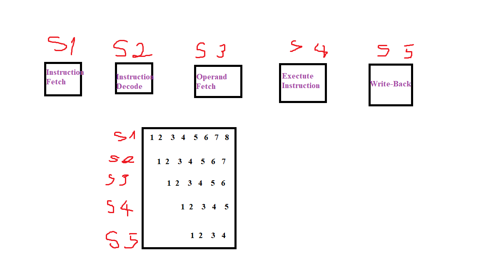


## Explique claramente por qué se dice que la UAL en SuperAbaus se utiliza tanto para la suma de datos como de direcciones. Justifíquelo con microinstrucciones y el gráfico de la máquina.

La UAL en SuperAbaus se utiliza tanto para la suma de datos como de direcciones ya que los registros generales de esta máquina pueden contener tanto datos como direcciones. Adicionado a esto, como la UAL es el único sumador de la máquina, podemos afirmar que la UAL es la encargada de operar tanto entre datos y direcciones.

Para justificar la suma de direcciones podemos usar las microinstrucciones de la fase de búsqueda, ya que R0 hace las veces de RPI (un registro que tiene la dirección de la próxima instrucción a ejecutar):

```
Fase de Búsqueda
(R0) -> RDM
((RDM)) -> RM
(RM) -> RI
(R0) -> AC
(AC) + 1 -> AC
(AC) -> R0
```

Para justificar la suma de datos podemos usar las microinstrucciones de la instrucción `SUMAR 1, 100`, siendo `100` un inmediato:

```
Fase de Ejecución de SUMAR 1, 100
(R1) -> AC
(AC) + 100[16] -> AC
(AC) -> R1
```

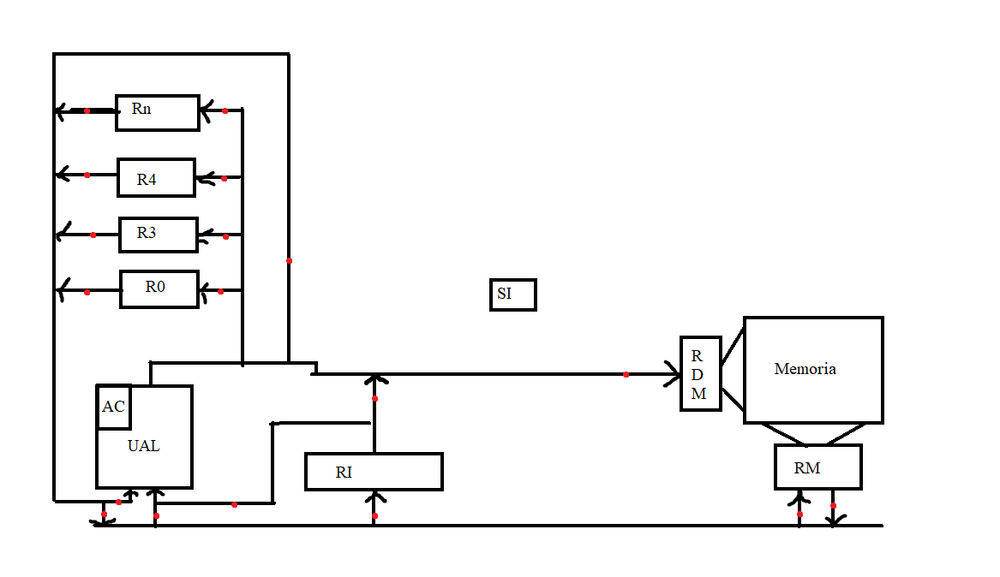

## Grafique el esquema general de un archivo de código objeto e identifique y explique cada una de sus secciones, indicando para que se usan.

Secciones de código objeto:

* Identificación: nombre del módulo y longitud de sus partes.

* Tabla de Puntos de Entrada: símbolos definidos en este módulo que pueden ser referenciados desde otros módulos.

* Tabla de Referencias Externas: lista de símbolos que son referenciados en este módulo, pero definidos fuera de él.

* Código Ensamblado y Constantes: el código y las constantes del programa propiamente dicho.

* Diccionario de Reubicabilidad: lista de direcciones que precisan ser reubicadas al cargar el módulo.

* Fin de Módulo: señaliza el fin de este módulo.


## Indique claramente que es el linking dinámico en tiempo de ejecución y cuáles son las diferencias frente al linking estático.

El linking dinámico en tiempo de ejecución es una metodología de enlace de un programa (combinar varios módulos objetos en un solo archivo cargable) en la cual la resolución de las referencias a otros módulos se resuelve en tiempo de ejecución, a diferencia del linking estático, el cual resulve las referencias antes de ejecutarse el programa.

El proceso del linking dinámico es el siguiente: se crea un load module sin las referencias externas resultas (el linking estático en este punto ya resolvió las referencias), luego ejecuta el programa. Una vez que se topa con una referencia sin resolver, recién ahí busca y carga el módulo externo, realiza el linking y sigue ejecutando hasta encontrase con otra referencia. El proceso sigue hasta que se termine la ejecución del programa.

Otras diferencias con el linkeo estático es que los ejecutables linkeados dinámicamente son mucho más livianos, pero tienden a ser más lentos. Una ventaja del linking dinámico en tiempo de ejecución es que el programa no ocupa memoria hasta que realmente se necesita.

## Indique cuales son las microinstrucciones necesarias para ejecutar la instrucción SUMAR 3,4 en una maquina SuperAbacus, siendo 3 y 4 registros de uso general. Graficar en el esquema, el flujo de apertura de compuertas usadas en la fase de ejecución de dicha instrucción.

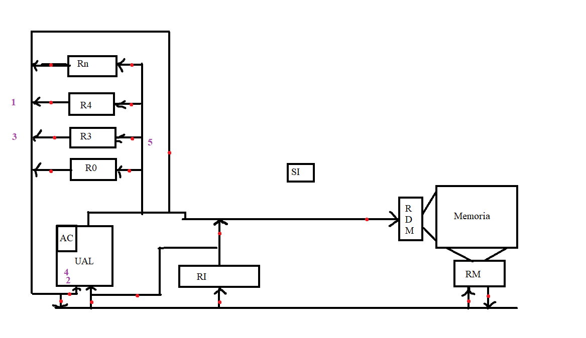

```
Fase de Ejecución de SUMAR 3,4
(R4) -> AC
(AC) + (R3) -> AC
(AC) -> (R3)
```

## Cuales son las clasificaciones de procesamiento en paralelo de datos (2 métodos).

Los procesadores paralelos de datos cuantan con una unidad de control y multiples procesadores. Se clasifican en:

* Single Instruction Multiple Data: múltiples procesadores ejecutan la misma secuencia de 
pasos sobre un conjunto diferente de datos.

* Vectoriales: operan mediante pipelining sobre registros vectoriales.

## Explique claramente de qué se trata la técnica de procesamiento en paralelo Superscalar en un procesador. Grafique en forma esquemática cómo funciona dicha técnica y dé un ejemplo de algún procesador comercial que la incluya.

Es una técnica de paralelismo que busca solapar la ejecución de instrucciones, ejecutando más de una por ciclo de reloj, usando multiples unidades funcionales. Un ejemplo de procesador que lo usa es el Intel Core.

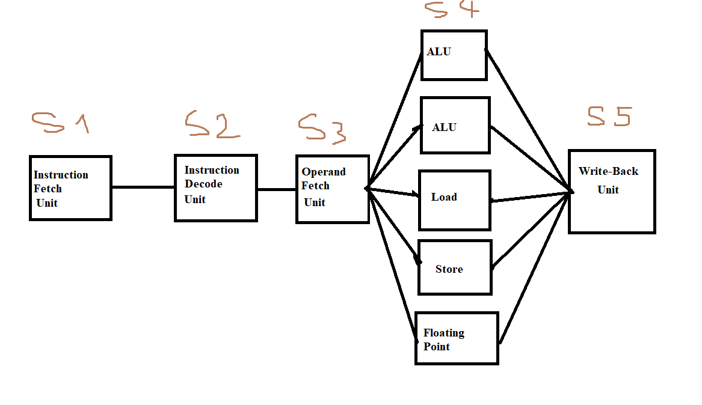


## Explique claramente qué es y cómo funciona el modo de direccionamiento pre-indexado autoindexado (registro indirecto con pre-incremento) en la arquitectura ARM de 32 bits. De un ejemplo.

Ejemplo de instrucción: `LDR R0, [R1, #4]!`

Es un modo de direccionamiento el cual nos permite copiar en un registro lo apuntado por una determinada dirección de memoria, la cual incrementamos previamente.

Para explicar el funcionamiento, me baso en la instrucción del ejemplo. En `R0` queda copiado el contenido. En `R1` va a estar una dirección de memoria. A la derecha de `R1` va a hacer un inmediado, el cual simboliza el desplazamiento que vamos a hacer. El `!` del final de la instrucción activa el write-back, permitiendo la modificación permanente del registro `R1`. Lo que se va a hacer es copiar en el registro `R0` el contenido de la dirección de memoria `R1 + 4`, haciendo que cuando termine la ejecución de la instrucción `R1` valga `R1 + 4`.

## Explicar el procesamiento en paralelo por multiprocesadores.

En el procesamiento en paralelo por multiprocesadores se tienen múltiples CPUs fuertemente acopladas que comparten memoria común. Son sistemas MIMD (Multiple Instructions Multiple Data).

Clasificaciones:

* Acceso uniforme: bus único y memoria centralizada. Todos los procesadores acceden a la memoria con el mismo tiempo de acceso, sin importar qué procesador la pida.

* Acceso no uniforme: cada procesador tiene memoria local propia además de acceso a memoria compartida. El tiempo de acceso varía según si el dato está en la memoria local del procesador o en la de otro.

## Explique claramente qué es y cómo funciona el modo de direccionamiento doble registro indirecto (registro indirecto indexado) en la arquitectura ARM de 32 bits. Dar ejemplo en assembler.

Ejemplo en assembler: `LDR R0, [R1, R2]`

Es un modo de direccionamiento que permite acceder al contenido en memoria de una determinada direccion que está en un registro, sumada con un offset presente en otro registro.

En este modo de direccionamiento se usan tres registros. Uno donde se va a dejar el contenido, otro el cual contiene la dirección en memoria a leer y otro registro que contiene un desplazamiento a realizar. Usando el ejemplo dado, lo que se hace es dejar en `R0` el contenido de la dirección de memoria `R1 + R2`. Vale la pena aclarar que, a diferencia de otros modos de direccionamiento, ni el registro `R1` ni `R2` se modifican.
